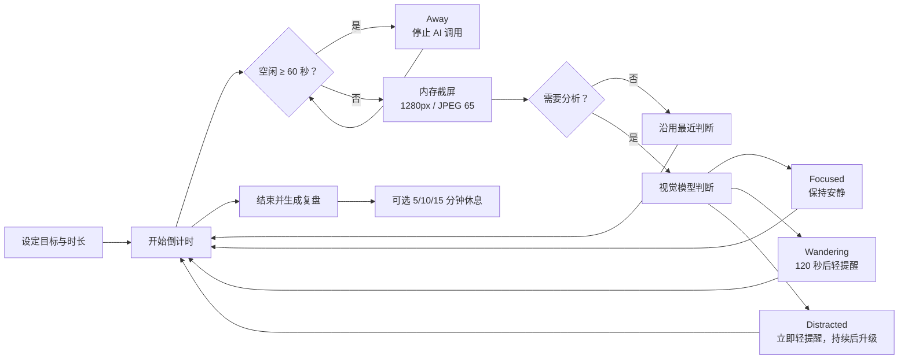
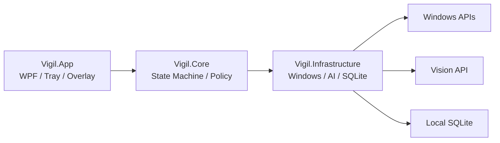

<div align="center">
  
  <h1>ADHD Focus Guard</h1>
  <p>一个面向 ADHD 友好体验、隐私优先、渐进提醒的 Windows AI 专注助手。</p>

  [](https://www.microsoft.com/windows/windows-11)
  [](https://dotnet.microsoft.com/)
  [](https://github.com/anqingan/ADHD-Focus-Guard/actions/workflows/ci.yml)
  [](#质量与测试)
</div>

> [!IMPORTANT]
> ADHD Focus Guard 会把压缩后的主屏幕截图发送给你配置的视觉模型服务，但不会把截图写入磁盘。使用前请确认你接受对应服务商的隐私政策。

> [!NOTE]
> 本项目是自我管理辅助工具，不提供 ADHD 诊断、治疗或医疗建议，也不替代专业医疗服务。

## 它解决什么问题

普通番茄钟知道时间过去了多久，却不知道你是否仍在做最初的事情。ADHD Focus Guard 让用户先写下本轮目标，再以较低频率观察屏幕，由视觉模型判断当前活动是专注、轻微走神还是明确分心，并按照偏离程度渐进提醒。

它不是员工监控、屏幕录像或行为审计工具。截图只在内存中短暂存在；长期保存的只有目标、时长分布、完成状态和最终复盘。

## 核心能力

| 能力 | 当前实现 |
| --- | --- |
| 目标与计时 | 15/25/45/60 分钟预设，自定义 1–300 分钟 |
| 智能判断 | 兼容 Chat Completions 的视觉模型，默认 Kimi K2.6 |
| 渐进纠偏 | 专注不打扰、走神延迟提醒、明确分心逐步升级 |
| 离开检测 | 本机检测键鼠空闲，离开期间停止调用模型 |
| 结束复盘 | 云端生成 4–6 句中文总结，失败时使用本地模板 |
| 休息计时 | 专注结束后可选择 5、10、15 分钟休息 |
| Windows 集成 | 系统托盘、全局快捷键、声音、胶囊和全屏遮罩 |
| 历史记录 | SQLite 保存会话摘要，支持单条删除和全部清空 |

## 工作方式



应用每 5 秒运行一次本地观察调度，但不会每 5 秒请求一次 AI。满足下列任一条件时才发送截图：

- 本轮第一次观察；
- 刚从 `Away` 状态返回；
- 256-bit dHash 汉明距离达到 40；
- 距离上一次成功判断达到 60 秒；
- 当前已明确分心，距离上一次成功判断达到 30 秒。

任何时刻只允许一个 AI 请求。请求期间出现的新观察会合并为一个 latest-only 待处理观察，避免形成请求队列和费用堆积。

## 状态和提醒规则

模型只返回三种语义状态，`Away` 由 Windows 本机检测产生，网络错误则由独立的可用性状态表示：

| 状态 | 判断来源 | 提醒策略 |
| --- | --- | --- |
| `Focused` | AI | 不提醒 |
| `Wandering` | AI | 连续 120 秒后显示 8 秒顶部胶囊，持续时每 60 秒最多一次 |
| `Distracted` | AI | 首次立即胶囊、托盘和声音；连续 30 秒且至少两次独立判断后显示一次全屏遮罩 |
| `Away` | 本机 | 空闲 60 秒进入；总空闲 180 秒召回，此后每 30 秒重复 |

全屏遮罩提供“返回目标”和“AI 误判，本段不再提醒”。误判静音只影响当前连续分心区间，模型明确离开 `Distracted` 后自动复位。

## 隐私与安全

ADHD Focus Guard 的设计边界是“发送必要信息，但不建立屏幕行为档案”：

- 截图缩放到最长边 1280，JPEG 质量 65，只在内存中处理；
- Vigil 自己的主窗口、胶囊和遮罩通过 `WDA_EXCLUDEFROMCAPTURE` 排除出截图；
- 截图、Base64、逐帧活动和临时图片文件不会写入磁盘；
- API Key 使用 Windows DPAPI `CurrentUser` 加密，并与 Base URL 绑定；
- HTTP 只接受 HTTPS，拒绝带用户信息、查询参数和片段的 Base URL；
- 禁止自动重定向，避免 Bearer Token 被转发到其他端点；
- 响应体限制为 1 MiB，日志不记录密钥、请求正文、图片或完整响应；
- 会话结束后清理 JPEG、dHash 和临时分心活动引用；
- 迟到的 AI 结果带有 generation 校验，不能修改已结束会话。

本地目录位于 `%LocalAppData%\Vigil`：

| 文件 | 内容 |
| --- | --- |
| `settings.json` | Base URL 和模型名，不含密钥 |
| `api-key.bin` | DPAPI 加密后的 API Key |
| `Vigil.db` | 目标、统计与最终复盘 |
| `vigil.log` | 有长度限制且不含请求正文的错误日志 |

> [!NOTE]
> 目标和最终复盘目前以明文保存在当前 Windows 用户的 SQLite 数据库中。截图虽然不落盘，但会发送给所配置的云端服务。

## 模型配置

默认配置：

```text
Base URL: https://api.moonshot.cn/v1
Model:    kimi-k2.6
```

Kimi K2.5/K2.6 请求会自动关闭深度思考。屏幕判断最多生成 200 Tokens，复盘最多生成 600 Tokens，以降低延迟和费用。连接测试使用程序生成的 `VIGIL TEST 42` 图片，不会截取真实桌面。

也可以配置其他兼容 Chat Completions、支持 JPEG Data URL 图片输入的 HTTPS 服务。程序请求地址固定为：

```text
{BaseUrl}/chat/completions
```

## 环境要求

- Windows 11 x64；
- [.NET 10 SDK](https://dotnet.microsoft.com/download/dotnet/10.0)；
- 一个支持图片输入的兼容 Chat Completions API。

## 从源码运行

```powershell
git clone https://github.com/anqingan/ADHD-Focus-Guard.git
cd ADHD-Focus-Guard
dotnet restore Vigil.Windows.slnx
dotnet run --project src/Vigil.App/Vigil.App.csproj
```

首次启动后打开模型配置，填写 Base URL、模型名和 API Key，保存并执行连接测试。开始会话后关闭主窗口只会隐藏到托盘，不会退出程序。使用 `Ctrl+Alt+Shift+Space` 可以随时重新显示主窗口。

## 构建与发布

编译和测试：

```powershell
dotnet build Vigil.Windows.slnx --configuration Release
dotnet test Vigil.Windows.slnx --configuration Release
dotnet list Vigil.Windows.slnx package --vulnerable --include-transitive
```

生成依赖本机 .NET 10 Desktop Runtime 的 x64 发布包：

```powershell
.\scripts\publish.ps1
```

生成体积更大但无需预装 .NET Runtime 的自包含发布包：

```powershell
.\scripts\publish.ps1 -SelfContained
```

输出位于 `artifacts\ADHD-Focus-Guard-win-x64`。当前项目还没有安装器、代码签名和自动更新，Windows SmartScreen 可能会提示未知发布者。

## 项目结构

```text
ADHD-Focus-Guard
├─ src
│  ├─ Vigil.App             WPF 界面、托盘、快捷键和提醒窗口
│  ├─ Vigil.Core            状态机、计时、dHash 和干预策略
│  └─ Vigil.Infrastructure  截屏、Windows API、AI、DPAPI 与 SQLite
├─ tests
│  └─ Vigil.Tests           单元、HTTP 合约及 Windows 集成测试
├─ tools
│  └─ Vigil.Configure       本机安全配置与合成图片连接测试
├─ docs
│  └─ 产品功能与实现逻辑.md
└─ scripts
   └─ publish.ps1
```



`Vigil.Core` 不依赖 WPF，集中维护产品规则；`Vigil.Infrastructure` 实现所有平台和外部系统访问；`Vigil.App` 只负责用户交互和 Windows 桌面集成。

更完整的状态流转、提醒策略、数据结构和隐私边界见 [产品功能与实现逻辑](docs/产品功能与实现逻辑.md)。

## 质量与测试

当前自动化测试覆盖：

- 256-bit dHash 和阈值边界；
- 四态时间累计及未知时间守恒；
- 走神、分心升级、误判静音和跨会话清理；
- latest-only 并发、取消、超时及停止后的迟到结果；
- HTTP 401/429/5xx、空响应、代码围栏 JSON 和超大响应；
- DPAPI 密钥保护、端点篡改和 SQLite 中断会话；
- 截图不落盘、GDI 资源释放及前台窗口句柄释放；
- 休息自动结束、提前结束以及休息期间不调用 AI。

当前 Release 验证为 35 项测试通过，NuGet 已知漏洞为 0。GitHub Actions 在 `windows-latest` 上执行 Release 构建和测试。

## 当前限制

- 仅支持 Windows 11 主显示器；
- 仅提供简体中文界面；
- 没有本地模型、多显示器、安装器、签名和自动更新；
- 睡眠和锁屏期间截止时间继续推进，无法观察的时间计入未知；
- AI 判断可能误判，提醒设计用于辅助自我管理，不应作为考勤或绩效依据。

## 路线图

- 多显示器与显示器选择；
- MSIX/安装器、代码签名和自动更新；
- 可配置的模型分层复核与费用上限；
- 本地视觉模型和完全离线模式；
- 数据库加密、导出和统计趋势；
- 多语言与无障碍体验。

## 与原 Vigil 的关系

本项目参考了 [ccmilu/Vigil](https://github.com/ccmilu/Vigil) 的产品理念，但 Windows 版本从零使用 C#、WPF 和 Windows API 实现，不复制 Swift 平台代码。原项目仅作为产品逻辑参考。

## 贡献与安全

提交改动前请阅读 [CONTRIBUTING.md](CONTRIBUTING.md)。发现安全问题时请不要公开提交包含密钥、截图或隐私数据的 Issue，处理方式见 [SECURITY.md](SECURITY.md)。

## 许可证

当前仓库尚未指定开源许可证。源代码可供查看和评估，但在许可证明确前，不默认授予复制、修改或分发权。公开推广或接受外部贡献前，应完成与原项目边界相关的许可证审查。
