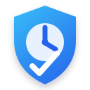
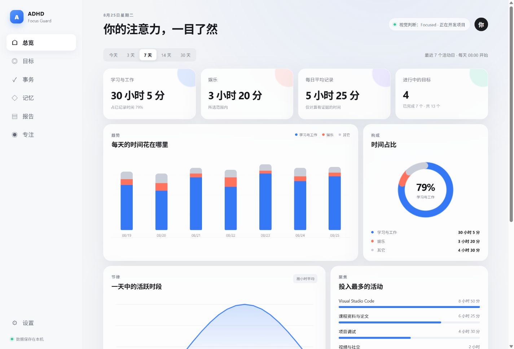
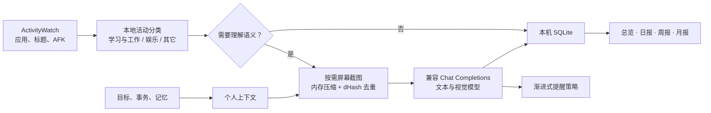

<div align="center">
  
  <h1>ADHD Focus Guard</h1>
  <p><strong>把零散的电脑活动，变成可理解、可复盘、可行动的个人注意力系统。</strong></p>
  <p>ActivityWatch 本地记录 · 按需视觉理解 · 目标与记忆 · 日/周/月复盘</p>

  <p>
    <a href="https://github.com/anqingan/ADHD-Focus-Guard/actions/workflows/ci.yml"></a>
    <a href="LICENSE"></a>
    
    
    
  </p>

  <p>
    <a href="#快速开始">快速开始</a> ·
    <a href="docs/使用指南.md">使用指南</a> ·
    <a href="docs/产品功能与实现逻辑.md">实现逻辑</a> ·
    <a href="CONTRIBUTING.md">参与贡献</a>
  </p>
</div>



> 上图使用演示数据，仅用于展示界面。ADHD Focus Guard 是个人自我管理工具，不是医疗产品，也不是员工监控软件。

## 为什么做这个项目

传统时间记录告诉你“打开了什么”，普通番茄钟告诉你“过去了多久”，但它们很难回答更重要的问题：这段时间是否真的在推进目标？今天的安排是否合理？最近一周的注意力被什么占据？

ADHD Focus Guard 将这些问题连成一条完整链路。ActivityWatch 提供低成本、持续的本地活动证据；视觉模型只在需要理解屏幕语义时按需调用；目标、事务和记忆帮助 AI 理解个人背景；日报、周报和月报最终把记录转成客观复盘。系统默认保持安静，只在偏离足够明确、持续足够久时提醒。

## 核心能力

| 能力 | 现在能做什么 |
| --- | --- |
| 自动活动记录 | 从本机 ActivityWatch 读取应用、窗口、浏览器域名和 AFK 状态；未知标题短暂攒批后由文本 AI 一次分类并回填规则 |
| 按需视觉理解 | 工作状态下定期观察主显示器，由多模态模型判断 `focused`、`wandering` 或 `distracted` |
| 渐进式纠偏 | 专注不打扰；轻微走神延迟轻提醒；明确分心先轻提醒，再按持续时间升级 |
| 目标系统 | 管理长期方向、阶段、本周和今日目标；完成、暂停或放弃后仍保留完整历史 |
| AI 今日计划 | 将自然语言安排拆成可验证的今日目标；确认前可逐项修改、调整关联或删除，只保存最后保留的内容 |
| 事务与记忆 | 随手写下事务，由 AI 整理并预览；手动或 AI 生成记忆，AI 内容必须经用户确认 |
| 客观复盘 | 生成日报、周报和月报，展示时间构成、活动节律、目标进展和基于证据的建议 |
| 手动专注 | 保留 1–300 分钟的目标倒计时、专注状态统计和会话总结 |
| 本地工作台 | WPF 负责系统能力，日常界面在浏览器打开；数据可 ZIP 导出、恢复或清空 |

## 它如何工作



后台每 5 秒读取一次当前活动，但并不意味着每 5 秒调用一次 AI。自动视觉仅在系统已经识别出持续的“学习与工作”状态、用户没有 AFK、Windows 截屏排除可用且预算未暂停时启用。首帧、画面 dHash 明显变化，或距离上次判断达到强制间隔时才发起请求；同一时刻只允许一个请求，积压时只保留最新一帧。

不开启手动专注模式也能工作。学习与工作持续约 30 秒后进入自动工作状态；如果随后被 ActivityWatch 明确识别为娱乐，连续约 2 分钟会第一次提醒，约 5 分钟会再次提醒。未知活动会先暂存为“其它”。系统约每 30 秒检查积压，累计 5 个不同标题或最早项目等待 2 分钟后，一次把最多 50 个精简标题交给文本 AI 分类；结果会回填同类历史片段，并在置信度足够时形成可复用规则。AI 仍无法确认的系统界面或模糊标题继续保留为“其它”，不会强行编造类别，也不会生成永久规则。微信、QQ、TIM 和企业微信等通信工具默认归入“其它”，不会因为聊天属性被算作娱乐；有明确用途时可以手动改为“学习与工作”。

视觉判断只产生三种 AI 状态：`focused` 表示与目标直接相关，`wandering` 表示关联较弱或证据不足，`distracted` 表示明确偏离目标。`away` 完全由 Windows 输入空闲检测产生；网络或模型故障则单独标记为不可用，不会被伪装成某种专注状态。

## 隐私设计

隐私不是附加设置，而是项目的默认边界。

| 数据 | 保存位置 | 是否发往模型 |
| --- | --- | --- |
| API Key | Windows DPAPI CurrentUser 加密 | 仅作为 HTTPS Bearer 凭据 |
| 屏幕图片 | 只在内存中短暂停留，不写磁盘 | 仅在触发视觉判断时发送 |
| ActivityWatch 原始数据 | ActivityWatch 自己的本机存储 | 不上传原始数据库；低置信度活动可发送精简文本分类 |
| 目标、事务、记忆 | `%LocalAppData%\Vigil\Vigil.db`，敏感文本使用 DPAPI 保护 | 仅在对应 AI 功能需要时发送 |
| 日志 | `%LocalAppData%\Vigil` | 不记录 API Key、请求正文、图片 Base64 或完整模型响应 |

本地网页服务只监听随机的 `127.0.0.1` 端口，使用每次启动随机生成的 HttpOnly 会话令牌，并限制跨来源写操作。所有 Vigil 原生窗口会请求 Windows 截屏排除；如果主窗口无法成功排除，自动视觉识别会停用。

请注意：视觉判断仍然需要将压缩截图发送给你自己配置的云端模型服务。使用前请阅读对应服务商的隐私政策，不要在目标或记忆中写入不必要的敏感信息。导出 ZIP 不包含 API Key、截图、日志或 ActivityWatch 原始库，但 ZIP 本身没有密码保护。

## 快速开始

### 环境要求

- Windows 11 x64
- [.NET 10 SDK](https://dotnet.microsoft.com/download/dotnet/10.0)
- [ActivityWatch](https://activitywatch.net/)；仅手动专注模式可以不安装
- 支持 Chat Completions 的文本模型，以及支持图片输入的视觉模型

### 从源码运行

```powershell
git clone https://github.com/anqingan/ADHD-Focus-Guard.git
cd ADHD-Focus-Guard
dotnet restore Vigil.Windows.slnx
dotnet run --project src/Vigil.App/Vigil.App.csproj
```

启动后应用驻留在系统托盘，并在默认浏览器打开本地工作台。进入“设置”，填写 Base URL、API Key、文本模型与视觉模型，然后先执行连接测试。测试使用程序生成的合成图片，不会截取真实屏幕。

默认配置面向 DeepSeek 兼容接口：

```text
Base URL     https://api.deepseek.com
Text model  deepseek-v4-flash
Vision      deepseek-v4-flash-vision-exp
```

模型名称和可用性由服务商决定；如果实验模型下线或改名，只需在设置页更换，不需要修改代码。Base URL 必须是 HTTPS，程序统一请求 `{BaseUrl}/chat/completions`。

### 构建可运行目录

依赖本机 .NET 10 Runtime 的轻量发布：

```powershell
.\scripts\publish.ps1
```

包含运行时的独立发布：

```powershell
.\scripts\publish.ps1 -SelfContained
```

输出位于 `artifacts/ADHD-Focus-Guard-win-x64`。当前版本没有安装器和代码签名，Windows 可能显示未知发布者提示；请只运行自己构建或从本仓库 Releases 下载的文件。

## 使用方式

第一次启动电脑后的活动日以每天 08:00 为边界。你可以在今日计划弹窗或目标页一次写下今天想完成的事情，AI 会先生成可编辑的拆分与归类预览，只有确认后才写入目标。

平时让 ActivityWatch 在后台运行即可。ADHD Focus Guard 会持续记录活动，在明确进入工作状态后自动启动低频视觉判断；你也可以在“专注”页主动开始一段目标明确的计时。关闭浏览器标签页不会退出后台程序，显示、停止当前会话和退出都可以从托盘完成，全局快捷键为 `Ctrl+Alt+Shift+Space`。

统计页可以切换今天、3 天、7 天、14 天和 30 天，集中查看分类堆叠图、时间占比、24 小时节律、活动排行、时间线、当前目标和 AI 预算。分类明细会分别列出“学习与工作、娱乐、其它”的总时长、全局占比和该类最主要的活动；总榜与时间线也带有明确的类别标签，方便直接核对每项活动被归到了哪里。更完整的步骤见[使用指南](docs/使用指南.md)。

## 技术架构

```text
src/
├─ Vigil.Core/            领域模型、状态机、dHash、计时与提醒策略
├─ Vigil.Infrastructure/  ActivityWatch、GDI、DPAPI、SQLite、AI 与导入导出
└─ Vigil.App/             WPF 宿主、本地 ASP.NET Core 服务和浏览器工作台
tests/
└─ Vigil.Tests/           核心规则、HTTP 合约、数据库与 Windows 集成测试
```

WPF 宿主负责托盘、全局快捷键、提示音、顶部胶囊、全屏遮罩和 Windows 截屏排除。ASP.NET Core/Kestrel 仅监听回环地址，向原生 HTML/CSS/JavaScript 工作台提供本地 API。核心规则放在不依赖 UI 的 `Vigil.Core`，便于单元测试和未来替换界面。

主要依赖保持克制：`.NET 10`、WPF、ASP.NET Core、`Microsoft.Data.Sqlite`、Windows 原生 API 和 ActivityWatch HTTP API。项目没有遥测 SDK、广告 SDK 或云端账户系统。

## 开发与验证

```powershell
dotnet test Vigil.Windows.slnx --configuration Release
dotnet build Vigil.Windows.slnx --configuration Release
dotnet list Vigil.Windows.slnx package --vulnerable --include-transitive
```

测试覆盖 dHash 边界、latest-only 并发、状态累计、空闲切换、渐进提醒、误判静音、停止后的迟到结果、ActivityWatch 合约、AI 预算、SQLite/DPAPI 往返、目标历史、事务、记忆和今日目标分析。涉及截屏、DPI、托盘、快捷键、睡眠恢复和真实模型的改动仍需要在 Windows 桌面进行人工验证。

## 当前边界与路线图

项目目前处于早期公开预览阶段，只支持 Windows 11、x64、简体中文和主显示器。暂不包含安装器、代码签名、自动更新、多显示器、本地模型、移动端、云同步或团队监控。

接下来的重点是提高未知活动的即时分类能力、减少自动模式盲区、补充多显示器与睡眠恢复测试、提供签名安装包，并让分类规则和费用估算更透明。规划背景与已确认的产品决策见[产品规划](docs/产品规划-v2-目标与活动记忆系统.md)。

## 参与贡献

欢迎提交 Issue 和 Pull Request，尤其是稳定性、隐私保护、ActivityWatch 兼容、Windows DPI、多显示器、无障碍和测试覆盖方面的改进。提交前请先阅读[贡献指南](CONTRIBUTING.md)和[安全策略](SECURITY.md)。安全问题请优先使用 GitHub Private vulnerability reporting，不要在公开 Issue 中附带密钥、截图、数据库或日志原文。

## 致谢与来源说明

本项目从零使用 C# 实现。开源项目 [Vigil](https://github.com/ccmilu/Vigil) 提供了“目标驱动的屏幕理解与渐进纠偏”这一产品启发，但本仓库没有复制其 Swift 平台代码。ActivityWatch、DeepSeek 及其他第三方服务分别遵循其自身许可证与服务条款。

## License

[MIT License](LICENSE) © 2026 ADHD Focus Guard contributors.
