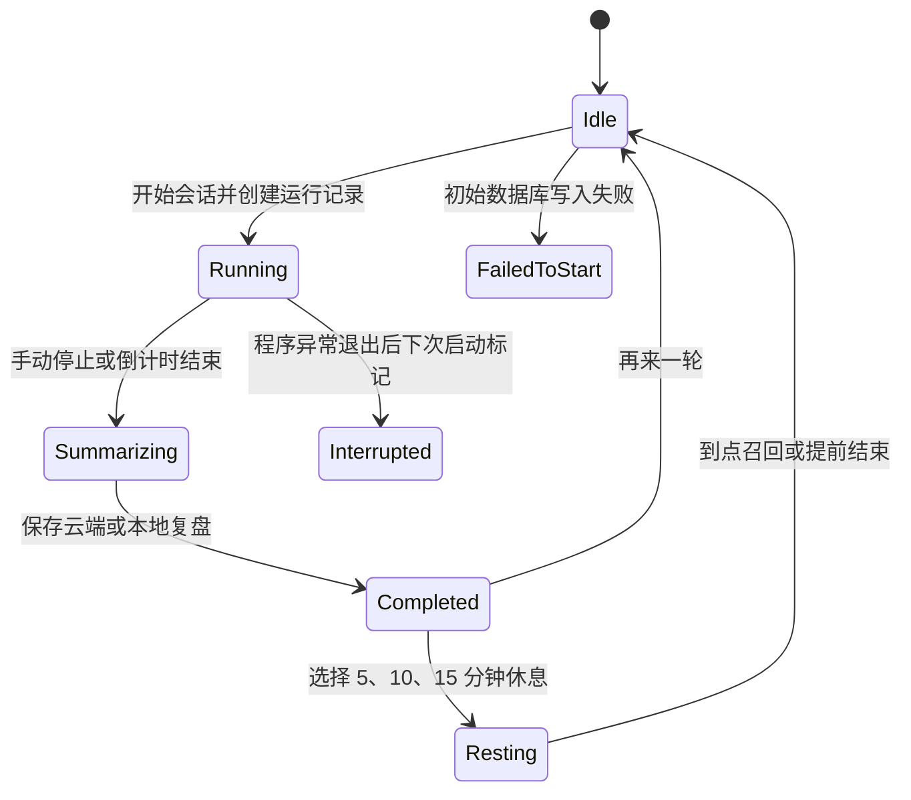
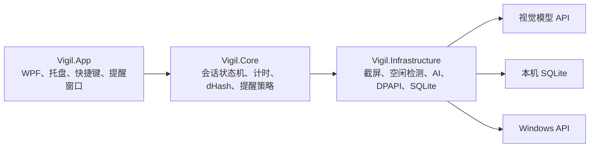

# ADHD Focus Guard 产品功能与实现逻辑

## 1. 产品定位

ADHD Focus Guard 是一款运行在 Windows 11 上、强调 ADHD 友好交互的专注辅助工具。用户先写下当前目标并设定专注时长，程序随后定期观察主显示器，通过支持图片输入的云端模型判断用户当前处于专注、轻微走神还是明确分心状态，再根据持续时间逐步提醒。会话结束后，程序会生成一段中文复盘，并将统计结果保存到本机。

它是自我管理辅助工具，不提供 ADHD 诊断、治疗或医疗建议，也不能替代医生或其他专业服务。

它不是屏幕录像、员工监控或行为审计软件。程序不保存截图，不保留逐帧记录，也不会把窗口活动明细长期写入数据库。它只保留完成一次专注会话所必需的汇总数据。

## 2. 当前功能

### 2.1 云端模型配置

设置页可以填写 Base URL、模型名称和 API Key。程序使用通用 Chat Completions 格式访问 `{BaseUrl}/chat/completions`，因此可以兼容支持图片输入的 OpenAI 风格服务。

当前本机已经配置为 Kimi 官方接口：Base URL 为 `https://api.moonshot.cn/v1`，模型为 `kimi-k2.6`。连接测试不会截取屏幕，而是生成一张包含 `VIGIL TEST 42` 的合成图片，让模型读取其中的文字。只有模型正确识别测试内容，连接测试才算通过。

API Key 不会写进 `settings.json`。它先通过 Windows DPAPI 以 CurrentUser 范围加密，再保存到独立密文文件中。密钥还会与保存时的 Base URL 绑定：如果配置文件被修改为另一个服务地址，原密钥不会被解密后发送过去；正常更换服务地址时，也必须重新输入密钥。

### 2.2 目标与倒计时

用户可以输入 1–200 个字符的目标，并选择或输入 1–300 分钟的专注时长。界面提供 15、25、45、60 分钟等常用值，也允许直接修改分钟数。

开始后，主窗口会隐藏到系统托盘，倒计时继续运行。主界面可以查看剩余时间、当前判断、正在进行的活动摘要和模型连接状态。用户可以随时手动停止；倒计时到零时会自动结束。

关闭主窗口不会退出程序，只会隐藏到托盘。托盘菜单提供显示窗口、停止当前会话和退出程序。全局快捷键 `Ctrl+Alt+Shift+Space` 可以重新显示主窗口。

### 2.3 智能屏幕判断

会话运行时，程序每 5 秒发起一次观察调度。首先通过 Windows `GetLastInputInfo` 检查用户多久没有键盘或鼠标输入。如果空闲时间达到 60 秒，程序直接判定为离开，不再截图，也不调用云端模型。

用户仍在电脑前时，程序通过 GDI 捕获主显示器。原始画面只存在于内存中，随后缩放到最长边不超过 1280 像素，并编码为质量 65 的 JPEG。程序同时将画面缩放成 17×16 灰度图，对相邻像素进行比较，生成 256-bit dHash。

并不是每次 5 秒观察都会产生一次付费请求。程序只有在第一次观察、当前 dHash 与上一次成功分析的汉明距离达到 40、刚从离开状态恢复，或者距离上一次成功判断达到 60 秒时，才调用模型。明确分心期间仍然每 30 秒强制复核，以便在连续分心达到 30 秒且获得两次独立判断后执行升级提醒。这样既能及时识别明显的屏幕变化，也能避免静止画面持续消耗费用。

发送给模型的信息只有当前目标、前台进程名、窗口标题和压缩后的 JPEG。模型必须返回以下三个状态之一：

| 模型状态 | 含义 |
|---|---|
| `focused` | 当前活动与目标直接相关 |
| `wandering` | 关联较弱、证据不足或有轻微偏离 |
| `distracted` | 明确从事与目标无关的活动 |

`away` 不由模型产生，而是由本机输入空闲检测产生。网络故障使用独立的 `ObservationAvailability.Unavailable` 表示，不会被统计成第五种专注状态。

### 2.4 AI 请求调度

程序在任何时刻最多允许一个屏幕分析请求。如果请求尚未完成时又到了新的观察周期，程序不会不断排队，而只记录一次“需要再观察”。当前请求结束后，它只补做最新的一次观察。这种 latest-only 机制可以防止慢请求造成队列、内存和费用持续增长。

单次 AI 请求硬超时为 30 秒。请求失败后，倒计时和本地统计不会停止。程序每 30 秒尝试恢复连接，并在界面显示一条连接异常信息。最近一次成功判断最多继续有效 30 秒，超过后观察状态会变为不可用，这段时间进入未知统计，旧判断不会继续触发提醒。

模型响应可以带 Markdown 代码围栏或前后说明文字。解析器会扫描响应并提取第一个完整 JSON 对象，同时正确处理字符串内部的大括号和转义字符。如果 `level`、`activity` 或 `reminder` 缺失、枚举错误或长度异常，本次判断会失败，不会立刻重复请求扣费。

HTTP 层只接受经过复检的 HTTPS Base URL，禁止用户名、查询参数和 URL 片段；自动重定向已关闭，避免 Authorization 跨端点转发。响应体最大为 1 MiB，活动摘要、提醒和最终复盘也有长度限制，防止异常服务返回超大内容占用内存。

### 2.5 休息计时

一次专注会话完成并生成复盘后，用户可以选择休息 5、10 或 15 分钟。休息使用独立的 `Resting` 状态和真实截止时间倒计时，不会截图、读取前台窗口或调用 AI，也不会生成新的会话记录。

开始休息后主窗口隐藏到托盘，重新打开时可以查看剩余时间，也可以从主界面或托盘提前结束。休息到点后，程序显示顶部胶囊和托盘通知、播放提示音，并把主窗口重新带到前台，方便输入下一轮目标。提前结束休息不会播放完成提醒。

## 3. 渐进式提醒逻辑

### 3.1 专注

模型判断为专注时，程序保持安静，不弹窗、不播放声音。专注状态的设计原则是尽量不打断用户。

### 3.2 轻微走神

轻微走神不会立即提醒。只有连续走神达到 120 秒，程序才会在主显示器顶部中央显示一个胶囊提醒，8 秒后自动关闭。如果仍然持续走神，此后最多每 60 秒再提醒一次。

### 3.3 明确分心

第一次进入明确分心状态时，程序立即显示顶部胶囊、托盘通知并播放提示音。如果分心持续达到 30 秒，而且至少获得两次独立的 `distracted` 模型判断，程序会显示一次全屏半透明遮罩。

遮罩提供“返回目标”和“AI 误判，本段不再提醒”两个操作。选择误判后，当前连续分心区间会被静音；只有模型明确判断用户离开 `distracted` 状态后，静音才会复位。每个连续分心区间最多显示一次全屏遮罩，之后只允许每 60 秒进行一次轻提醒。

### 3.4 离开电脑

输入空闲达到 60 秒后进入离开状态，并停止所有屏幕分析请求。空闲总时长达到 180 秒时，程序播放召回声音并显示轻提醒；如果用户仍未回来，此后每 30 秒重复。检测到新的键盘或鼠标输入后，召回立即停止，并强制进行一次新的模型判断。

## 4. 会话状态与计时

会话的主要状态流转如下：

运行期间，程序按真实 UTC 时间累计状态，而不是简单假定每个定时器恰好准时触发。每次状态变化前先把上一状态持续到当前时刻的时间计入统计，从而降低线程调度、系统繁忙和睡眠恢复造成的偏差。

统计包括专注、走神、分心、离开和未知时间。网络不可用、锁屏、截图失败或尚未获得第一次有效判断的时间会计入未知时间。四种状态时间加未知时间与实际会话时长的误差被控制在一次采样周期以内。

Windows 睡眠和锁屏不会暂停计划截止时间。系统恢复后，如果截止时间已经过去，会话会直接进入结束流程；恢复前无法观察的时间不会伪装成专注时间。

所有后台任务都带有会话 generation 标识。停止或结束会话时 generation 会递增，因此旧请求即使晚到，也不能改变状态、写入统计或触发提醒。会话结束还会清零 JPEG、dHash 和临时活动引用，避免敏感内容继续留在内存中。

## 5. 结束复盘与历史记录

会话期间，程序只在内存中保存最多五条不同的分心活动摘要。结束时，它会把目标、实际时长、四种状态秒数、未知秒数和这些临时摘要发给模型，请模型生成 4–6 句简体中文复盘。

如果总结请求失败或超时，程序会立即生成本地模板复盘，因此断网不会导致会话无法结束。最终只持久化目标、计划和实际时长、起止时间、完成方式、状态秒数、未知秒数及最终复盘；临时分心活动列表随后被清空。

历史记录保存在 `%LocalAppData%\Vigil\Vigil.db`，使用参数化 SQLite 查询，支持查看、删除单条和清空全部记录。运行中的会话会每 30 秒做一次尽力保存。如果某次写入因磁盘繁忙等原因失败，计时线程不会退出，后续周期会继续尝试。程序下次启动时，数据库中仍标记为 `Running` 的记录会被改为 `Interrupted`，但不会自动恢复旧会话。

## 6. 界面与截屏隔离

主窗口、顶部胶囊和全屏遮罩都调用 `SetWindowDisplayAffinity(WDA_EXCLUDEFROMCAPTURE)`，使 Vigil 自己的窗口不进入截图。如果 Windows 无法为主窗口启用排除保护，程序会禁用会话启动，避免把自身界面递归发送给模型。

顶部胶囊使用 WPF 设备无关单位放置在主显示器工作区顶部中央。全屏遮罩同样使用 WPF 的主屏尺寸，因此在非 100% DPI 缩放下不会把像素尺寸错误地当成界面尺寸。

## 7. 模块结构

`Vigil.Core` 不依赖 WPF，包含产品规则、状态累计、latest-only 调度和公开接口。`Vigil.Infrastructure` 实现 Windows 截屏、输入空闲、前台窗口、云端请求、安全配置和 SQLite。`Vigil.App` 负责界面、托盘、快捷键、提示音、胶囊和遮罩。

核心协调器是 `src/Vigil.Core/FocusSessionCoordinator.cs`，渐进提醒规则在 `src/Vigil.Core/InterventionPolicy.cs`，云端请求在 `src/Vigil.Infrastructure/OpenAiCompatibleClient.cs`，屏幕捕获在 `src/Vigil.Infrastructure/GdiScreenCaptureService.cs`，主界面在 `src/Vigil.App/MainWindow.xaml`。

## 8. 本地文件与隐私边界

程序的本地数据目录为 `%LocalAppData%\Vigil`：

| 文件 | 内容 |
|---|---|
| `settings.json` | Base URL 和模型名称，不包含 API Key |
| `api-key.bin` | DPAPI 加密并绑定 Base URL 的密钥密文 |
| `Vigil.db` | 目标、统计和最终复盘 |
| `vigil.log` | 不含请求正文、图片、完整响应和 API Key 的有限错误日志 |

屏幕截图、JPEG、Base64 和逐帧判断不会写入磁盘。日志在写入前去除换行并限制长度，也不会记录 Authorization、请求正文或完整模型响应。

仍需注意，目标和最终复盘目前以明文 SQLite 形式保存在当前 Windows 用户目录中；截图会发送到用户配置的云端模型服务。这两项是当前版本明确的信任边界。使用者应确认自己接受模型服务商的隐私政策，并避免在目标中填写不必要的敏感信息。

## 9. 当前版本暂不包含

当前版本只支持 Windows 11 的主显示器和简体中文，不包含本地模型、多显示器、连续打卡、AI 目标预审、逐帧记录、截图落盘、自动更新、安装器和多语言。程序目前以本机开发运行方式交付。

## 10. 验证情况

项目自动化测试覆盖 dHash、状态累计、渐进提醒、误判静音、latest-only 并发、陈旧 AI 结果、停止后的迟到响应、停止取消、数据库瞬时失败、HTTP 错误和超大响应、端点篡改、DPAPI、SQLite 中断记录、截图不落盘、重复截图 GDI 句柄以及前台进程句柄释放。

最近一次 Release 验证结果为 0 个编译警告、0 个编译错误、35 项测试全部通过、NuGet 已知漏洞为 0、安全分析器告警为 0。测试包含休息自动结束、提前结束和休息期间不调用 AI。真实 WPF 进程连续空闲采样 30 秒时，私有内存和句柄数量保持稳定；Kimi K2.6 合成图片连接测试也已通过。

这些验证能覆盖已知的实现风险，但不等于形式化证明不存在任何缺陷。公开发布前仍建议进行更长时间的真实模型压力测试、不同 DPI 和锁屏/睡眠人工测试，以及安装签名和隐私协议审查。
