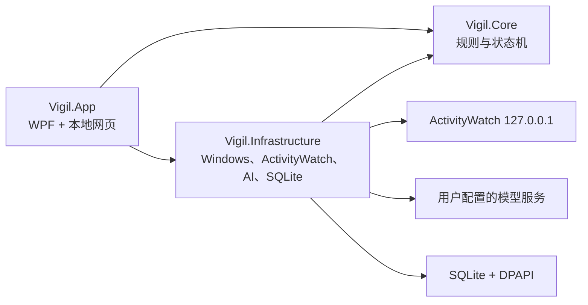

# ADHD Focus Guard：产品功能与实现逻辑

本文描述当前代码的实际行为。产品仍处于早期公开预览阶段，界面和阈值可能继续调整；发生冲突时以代码和测试为准。

## 产品定位

ADHD Focus Guard 是运行在 Windows 11 上的个人活动记忆与专注辅助工具。它结合 ActivityWatch、本机目标与记忆、按需云端视觉理解和渐进式提醒，帮助用户回答“今天做了什么、是否偏离目标、时间花在哪里、之后怎样调整”。

它不是 ADHD 诊断或治疗工具，也不是员工监控、屏幕录像或行为审计系统。当前只面向单机、单用户和主显示器。

## 两条并行工作链路

系统同时保留自动记录和手动专注，两者不会重复截图。

自动链路每 5 秒从本机 ActivityWatch 读取应用、窗口标题、浏览器域名和 AFK 状态，并将活动归为“学习与工作、娱乐、其它”。连续处于学习与工作约 30 秒后，系统进入自动工作状态并允许视觉理解；连续非工作约 120 秒后退出。明确娱乐持续约 2 分钟会轻提醒一次，持续到约 5 分钟再提醒一次，之后只记录，不重复打扰。

手动链路由用户输入本轮目标并设置 1–300 分钟倒计时。运行时使用相同的屏幕判断与提醒策略，会话结束后保存四态统计和复盘。手动会话运行时，自动视觉监控保持待命，避免同一画面产生两套请求。

系统没有休息模式、休息分类或休息倒计时。在电脑前发生的娱乐正常记为娱乐；离开电脑由 ActivityWatch AFK 和 Windows 输入空闲状态表达。

## 活动分类

`ActivityClassifier` 按以下优先级决定类别：用户纠正规则、内置应用/域名规则、与有效目标标题的匹配，最后是“其它”。手动纠正会形成可复用规则，用于之后相似的应用、域名或窗口标题。低置信度活动可以批量发送给文本模型分类，避免为每次窗口切换单独付费。

短于 10 秒的切换被合并为“短暂切换”，降低 Alt+Tab、通知窗口等噪声。AFK 时间不伪装成任何活动类别。

## 视觉理解何时调用 AI

自动视觉必须同时满足这些条件：ActivityWatch 已进入自动工作状态、用户没有 AFK、没有手动专注会话、Windows 成功排除本软件窗口、每日 AI 预算没有暂停非必要调用。

观察调度每 5 秒运行一次。程序通过 GDI `BitBlt` 捕获主显示器，将画面缩放并编码成内存 JPEG，同时计算 17×16 灰度图产生的 256-bit dHash。首次观察、dHash 汉明距离达到阈值，或距离上次成功判断达到强制间隔时才调用视觉模型。

任意时刻只允许一个 AI 请求。请求期间的新观察不会排队，而只保留一个 latest-only 标记；当前请求结束后重新捕获最新画面。停止会话或退出自动状态会增加 generation，迟到结果无法改写状态或触发提醒。

截图、JPEG 流和 Base64 引用只在内存存在，发送或失败后释放，不创建临时图片文件。API 日志不包含请求正文、图片或完整模型响应。

## 判断状态与提醒策略

视觉模型只返回 `focused`、`wandering`、`distracted`，并附带当前活动摘要和建议提醒文案。`away` 来自本机空闲检测；模型或网络故障使用独立的不可用状态，不计为第五种专注状态。

保持专注时完全不提醒。连续 `wandering` 约 120 秒后显示顶部胶囊，仍未恢复时最多每 60 秒再轻提醒一次。第一次 `distracted` 会立即显示胶囊、托盘通知并播放声音；持续约 30 秒且获得至少两次独立判断后，同一分心区间显示一次 15 秒全屏遮罩。

遮罩提供“返回目标”和“AI 误判，本段不再提醒”。误判静音只对当前连续分心区间有效，模型明确离开 `distracted` 后自动复位。

输入空闲达到阈值后停止截图和 AI。手动专注会话中的离开时间单独累计，不会被算成专注。

## 目标、事务与记忆

目标分为长期方向、阶段、本周和今日四种时间尺度，可处于未开始、进行中、暂停、完成或放弃等状态。完成、暂停和放弃不会删除记录；发送给 AI 的个人上下文只包含仍有效的目标。

今日目标必须经过“AI 分析—用户预览—确认保存”流程。AI 将自然语言拆成最多五个可验证目标，补充分类、完成标准、优先级、预计分钟数和上级目标关联。AI 只能引用程序提供的有效目标 ID，确认前不写数据库。

事务页允许一次输入多件安排，由 AI 生成结构化候选；用户可修改标题并确认。记忆既可手动写入，也可由 AI 提出候选；所有 AI 记忆必须确认后才成为正式记录。

## 统计与报告

活动日以每天 08:00 为边界。总览支持今天、3 天、7 天、14 天和 30 天，展示每日类别堆叠、类别占比、小时节律、活动排行、时间线、目标概况和预算。

日报、周报和月报由已记录活动、目标进展和记忆生成。报告区分事实、推断与建议；云端总结失败时使用本地模板，不因断网丢失统计。

每日 AI 软预算默认 1 元。达到预算时提示用户，可选择暂停自动视觉和非必要活动分类，也可以继续。金额是基于本地请求用量的估算，不替代服务商账单。

## 本地浏览器工作台

WPF 进程仍然是应用宿主，负责托盘、全局快捷键、截图排除、提醒胶囊、全屏遮罩和声音。日常 UI 由本机 ASP.NET Core 服务提供，在默认浏览器打开。

Kestrel 只绑定随机 `127.0.0.1` 端口。启动时生成随机会话令牌，通过首次 URL 换取 HttpOnly、SameSite=Strict Cookie，然后从地址栏移除令牌。修改数据的请求还要通过同源检查，响应包含严格 CSP、禁止嵌入、禁止缓存和 MIME 嗅探等安全头。

关闭浏览器标签页不会停止后台记录。托盘提供打开工作台、停止当前会话和退出；`Ctrl+Alt+Shift+Space` 可重新打开工作台。

## 数据与安全边界

普通设置保存在 `%LocalAppData%\Vigil\settings.json`。API Key 使用 Windows DPAPI CurrentUser 加密，并与服务地址绑定。个人数据库位于 `%LocalAppData%\Vigil\Vigil.db`，目标、事务、记忆和报告等敏感文本字段使用当前 Windows 用户的 DPAPI 保护。

导出 ZIP 不包含 API Key、屏幕图片、日志或 ActivityWatch 原始数据库，但导出包本身未加密。导入会校验文件类型、大小和结构。清空数据是显式、不可撤销的用户操作。

云端服务仍然能够看到用户主动发送的目标文本、活动摘要和按需截图，这是系统最重要的外部信任边界。Base URL 必须使用 HTTPS，自动重定向关闭，防止 Authorization 被转发到意外端点。

## 模块结构

`Vigil.Core` 不依赖 UI 或具体云服务，维护领域模型、状态累计、dHash、latest-only 调度和提醒规则。`Vigil.Infrastructure` 实现 ActivityWatch、屏幕捕获、空闲检测、DPAPI、SQLite、AI 客户端、预算和导入导出。`Vigil.App` 负责宿主生命周期与用户交互。

## 当前限制

当前只支持 Windows 11 x64、简体中文和主显示器，没有安装器、代码签名、自动更新、多显示器、本地模型、移动端或云同步。未知网页或应用可能暂时被归为“其它”，在规则或批量分类生效前不会触发娱乐提醒；这是自动模式目前最主要的保守盲区。
